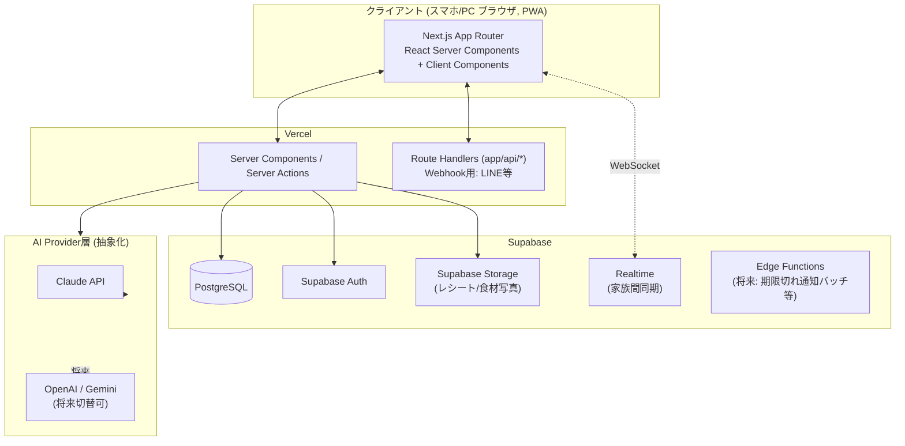

# ① システム構成提案

## 1. 全体アーキテクチャ



**要点**: Vercel + Supabase + Claude API の3サービスのみで完結。サーバー管理不要（フルマネージド）。個人〜同居2人利用のスケールなら十分すぎる余力があり、運用コストも最小。

---

## 2. Frontend

| 技術 | 採用理由 |
|---|---|
| Next.js 14+ (App Router) | Server Components でDBアクセスをサーバー側に閉じ込められる。Vercelとの親和性が最も高い。 |
| React 18 | Server/Client Component分離、Suspense対応 |
| TypeScript (strict) | Supabaseの型生成・Zodスキーマと合わせてEnd-to-Endの型安全性を確保 |
| Tailwind CSS | ユーティリティファーストで、余白多め・Apple風の一貫したデザインを高速に実装可能 |
| shadcn/ui | コピー&オーナーシップ型のコンポーネント。ダークモード・アクセシビリティ対応済みで、後から自由にカスタマイズ可能（npm依存ではなくコード資産として持てる） |
| Lucide Icons | shadcn/ui標準、軽量、線が細くApple風の質感に合う |

---

## 3. Backend: Next.js (API Routes/Server Actions) vs FastAPI

### 比較表

| 観点 | Next.js (Route Handlers + Server Actions) | FastAPI (別サーバー) |
|---|---|---|
| デプロイ | Vercelにフロントと一体でデプロイ。1リポジトリ・1デプロイで完結 | 別途ホスティングが必要（Render/Fly.io/Cloud Run等）。インフラが2系統になる |
| 型安全性 | TSでフロント〜サーバーアクションまで型を共有できる（Zodスキーマ共通化） | フロント(TS)とバック(Python)で型定義が分離し、二重管理になる |
| Supabase連携 | `@supabase/ssr`が公式にNext.js App Routerを一級サポート | Python用SDKもあるが、Auth CookieのSSR連携はNext.js側の方が成熟 |
| Claude API呼び出し | Vercel Serverless/Edge Functionから直接呼び出し可能。レイテンシ・構成ともにシンプル | 同様に可能だが、経由するホップが増えるだけでメリットが薄い |
| 開発体験(1〜2人チーム) | 言語・リポジトリが1つで認知負荷が低い | 2言語・2リポジトリの保守コストが発生 |
| 画像処理/OCR/将来のML | PythonのOCR/画像処理ライブラリ(Tesseract, OpenCV等)を使うなら有利 | - |
| 長時間バッチ処理 | Vercelの実行時間制限(Hobby:10s, Pro:60s〜300s)に注意 | 制限なく自由に処理可能 |

### 結論: **Next.js (Route Handlers + Server Actions) を採用し、FastAPIは導入しない**

理由:
1. 利用者が自分+彼女の2人という規模で、独立バックエンドを持つ運用コストに見合うメリットがない。
2. Claude APIはHTTPS経由のAPI呼び出しであり、Node.js(Next.js)からでも何ら不自由がない。
3. Vercel + Supabaseのみで完結する要件（デプロイ節）と直接合致する。
4. 型安全性・開発速度の観点でTypeScript統一の方が個人開発の保守性が高い。
5. 将来のレシートOCR/バーコード認識は、
   - OCR: Claude(Vision対応)またはGoogle Cloud Vision APIをNext.js Route Handlerから呼び出せば十分
   - バーコード: ブラウザ側JS(`@zxing/browser`等)でカメラスキャンし、商品名解決のみAPIを叩けばよい
   → いずれもPython/FastAPIでなければならない理由がない。
6. もし将来「重い自前MLモデル推論」が必要になった場合のみ、独立したPythonマイクロサービス(FastAPI on Cloud Run等)を**追加**すればよく、今の設計を壊さない（AI Provider層と同様、外部サービス呼び出しとして抽象化されているため）。

**API設計方針**（詳細は⑤で決定）:
- 更新系のユーザー操作（食材追加/編集/削除、買い物リスト操作等）→ **Server Actions**（フォーム送信・型安全・再検証が簡潔）
- 外部Webhook受信（LINE通知の返信等、将来）→ **Route Handlers** (`app/api/webhooks/line/route.ts`)
- Claude APIとのやり取り→ Server Actionsまたは Route Handler経由でService層(`services/ai/`)を呼ぶ。**Claude SDKをコンポーネントやActionから直接叩かない**（後述のAI Provider抽象化を必ず経由）

---

## 4. DB / Auth / Storage: Supabase

| 機能 | 用途 |
|---|---|
| PostgreSQL | 食材・レシピ・買い物リスト・世帯(household)データ |
| Supabase Auth | メール+パスワード（将来: LINEログイン等のOAuth拡張も可） |
| Supabase Storage | レシート画像、食材写真（将来のOCR機能用） |
| Supabase Realtime | 世帯内での在庫・買い物リストのリアルタイム共有（自分⇄彼女） |
| Row Level Security (RLS) | 世帯単位でのデータ分離（詳細は②DB設計で定義） |

「家族共有」を将来ではなく**最初から前提としたデータモデル**にする（`households`テーブルを軸に設計）。個人アカウント2つが1つの世帯に紐づく形。これによりRealtime同期・共有もRLSの延長で自然に実現できる。

---

## 5. AI Provider抽象化設計

### 目的
Claude APIを直接サービスコードやコンポーネントから呼ばない。将来OpenAI/Geminiに切り替え、またはマルチプロバイダ運用ができるようにする。

### インターフェース設計（概略）

```
lib/ai/
├── types.ts          # AiProvider interface, 共通の入出力型(Zodスキーマ)
├── provider.ts        # getAiProvider() ファクトリ（env: AI_PROVIDER=claude|openai|gemini）
├── prompts/            # プロバイダ非依存のプロンプトテンプレート
│   ├── suggest-recipes.ts
│   ├── missing-ingredients.ts
│   ├── menu-plan.ts
│   └── shopping-list.ts
└── providers/
    ├── claude-provider.ts     # Anthropic SDK実装
    ├── openai-provider.ts     # (将来)
    └── gemini-provider.ts     # (将来)
```

```typescript
// lib/ai/types.ts (概略イメージ)
interface AiProvider {
  suggestRecipes(input: SuggestRecipesInput): Promise<RecipeSuggestion[]>;
  suggestWithMissingIngredients(input: MissingIngredientsInput): Promise<MissingIngredientsResult>;
  suggestMenuPlan(input: MenuPlanInput): Promise<MenuPlanResult>;
  suggestShoppingList(input: ShoppingListInput): Promise<ShoppingListResult>;
}
```

- 各メソッドの入出力は **Zodスキーマで厳格に定義**し、Claudeの場合は Tool Use（Structured Output用ツール定義）で構造化JSONを強制取得する。
- `services/ai/*.ts` (Service層) が `AiProvider` を利用し、Server Actions/Route HandlersはService層のみを呼ぶ（Clean Architectureの依存方向: UI → Service → Provider Interface → 実装）。
- プロバイダ切替は環境変数 `AI_PROVIDER` の変更のみで完結。

---

## 6. PWA / 将来拡張との整合性

| 将来機能 | 今回の設計での対応方針 |
|---|---|
| PWA対応 | `next-pwa`導入 or 手動でmanifest.json + Service Worker。データ構造・APIは変更不要 |
| LINE通知 | `app/api/webhooks/line/route.ts` を追加するだけ。通知トリガーはSupabase Edge Function（期限チェックの定期実行）から呼ぶ想定 |
| レシートOCR | `services/ai/ocr-service.ts` を追加し、AI Provider層のVision機能 or 外部OCR APIを利用。Storageに画像保存→食材候補を抽出→ユーザー確認画面で登録、というフローをUI側に追加するだけでDB設計に影響なし |
| バーコード読取 | クライアント側スキャン(`@zxing/browser`)→JANコードでAPI照会→商品名/カテゴリを自動入力。`products`マスタテーブルをオプションで追加可能(②で検討) |
| チラシ連携 | 外部データソースが定まった時点でAI Providerのプロンプト入力に「特売情報」を追加するだけで対応可能 |
| ワンタップ在庫減算 | ①のUI設計・②のDB設計に最初から組み込み（`quantity`更新のクイックアクション） |
| リアルタイム家族同期 | Supabase Realtime + `households`テーブル設計により最初から対応 |
| ネイティブアプリ化 | PWAをベースに、将来React Native/Expoへ移行しやすいよう、ビジネスロジックをUIから分離（Service層・Hooks層に集約）しておく |

---

## 7. デプロイ構成

- **Vercel**: Next.jsアプリ本体（Production/Preview環境を自動構成）
- **Supabase**: DB / Auth / Storage / Realtime（Production 1プロジェクト、開発は同一プロジェクトのstagingスキーマ or 別プロジェクトを検討）
- **Anthropic Claude API**: サーバーサイドのみから呼び出し（APIキーはクライアントに一切露出しない）

### 環境変数（暫定・②以降で確定）

```
NEXT_PUBLIC_SUPABASE_URL=
NEXT_PUBLIC_SUPABASE_ANON_KEY=
SUPABASE_SERVICE_ROLE_KEY=      # サーバー専用、Route Handler/Server Actionのみで使用
AI_PROVIDER=claude
ANTHROPIC_API_KEY=
NEXT_PUBLIC_APP_URL=
```

---

## 8. この工程での設計レビュー観点

- ✅ 2人利用規模に対してオーバースペックな構成（マイクロサービス化・K8s等）を避けている
- ✅ 単一言語(TS)・単一デプロイ先(Vercel)で保守コストを最小化
- ✅ AI ProviderをInterfaceで抽象化し、ベンダーロックインを回避
- ✅ 将来機能（OCR/バーコード/LINE/家族共有）が既存構成の**拡張**で実現でき、再設計が不要
- ⚠️ Vercelの実行時間制限（Claude API呼び出しが長時間化する場合、Edge RuntimeよりNode.js Runtime + Streaming応答を検討する必要あり）→ ⑥Claude API実装時に対応
- ⚠️ Supabase無料枠の制限（DB容量500MB、Storage 1GB等）→ 個人利用なら十分だが、画像保存(レシート等)が増えた場合は容量監視が必要
