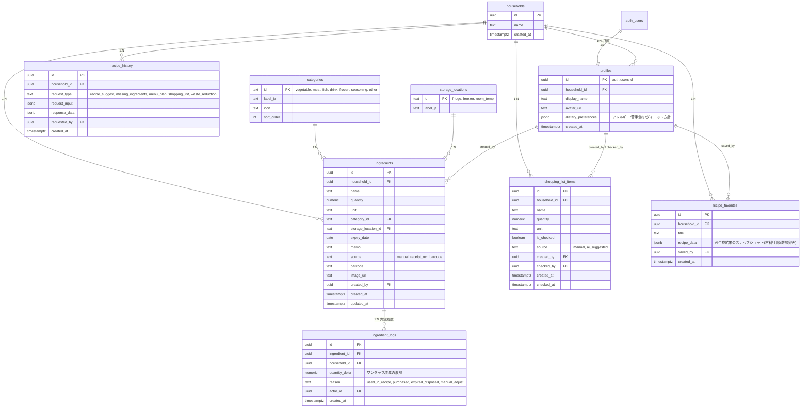

# ② データベース設計

## 1. 設計方針

- **世帯(household)単位**でデータを分離する。自分と彼女は同じ`household`に所属し、在庫・買い物リスト・お気に入り等は全て`household_id`に紐づく。
- RLSは「自分が所属するhouseholdのデータのみ読み書きできる」を基本ポリシーとする。
- 将来のOCR/バーコード/家族共有拡張を見据え、`source`(登録経路)や`barcode`等の拡張カラムを最初から持たせておく（NULL許容で今は未使用）。
- Supabase Auth の `auth.users` をそのまま利用し、アプリ独自の`profiles`テーブルで拡張情報(表示名・世帯・通知設定)を管理する。

---

## 2. ER図



---

## 3. テーブル定義

### `households`
| カラム | 型 | 制約 | 説明 |
|---|---|---|---|
| id | uuid | PK, default `gen_random_uuid()` | |
| name | text | not null, default `'わが家'` | 世帯名(表示用) |
| invite_token | text | not null, unique, default `encode(gen_random_bytes(16),'hex')` | 招待URL `/join/{invite_token}` に使用。再発行可能(後述) |
| created_at | timestamptz | not null, default `now()` | |

#### 招待URL(ログイン画面なし)の実現方式

要件: 「招待URLをタップするだけで、ログイン画面を挟まず同じ世帯の在庫が見える」を、RLSと操作者記録を維持したまま実現する。

**採用方式: Supabase Anonymous Auth(匿名認証) + 招待トークン**

1. あなたが「彼女を招待」→ アプリが `https://yourapp.com/join/{households.invite_token}` を生成
2. 彼女がそのURLを開く
3. クライアント側でSupabaseのセッションが無ければ `supabase.auth.signInAnonymously()` を自動実行(**画面上は何も表示しない**。パスワード入力もメール入力も不要)
4. 発行された匿名ユーザーの`auth.uid()`をキーに、`profiles`レコードを作成し `household_id` に招待元の`households.id`をセット(Server Action内で`invite_token`を検証してから実行)
5. 以後はブラウザ/PWAにSupabaseセッションが保持されるため、ホーム画面アイコンから開く限り再度この手順は発生しない(体験としては「ログイン不要」)

**このURLは`invite_token`単体では再利用可能な招待用URLであり、参加後の恒久的なアクセスキーではない点に注意**: 一度参加してprofilesが作られた後は、以後のアクセス制御は`profiles.household_id`(=匿名アカウントに紐づく)で行われる。つまり:
- URLが他人に漏れても、既に参加済みの2人のアクセスには影響しない(URLの再共有だけでは新しい匿名アカウントが世帯に増えるだけ)
- 意図しない第三者の参加を防ぐため、`invite_token`は世帯設定画面からいつでも再発行可能にする(再発行後は旧URLは無効化)
- 匿名アカウントはブラウザのlocalStorageにセッションを保持する方式のため、端末を変えたりブラウザデータを消すと再度招待URL(またはブックマーク)からの参加が必要になる。将来的にSupabaseの「匿名→本登録への昇格(linkIdentity)」機能でメール紐付けし、複数端末対応やバックアップを追加可能(将来拡張として設計を阻害しない)

### `profiles`
| カラム | 型 | 制約 | 説明 |
|---|---|---|---|
| id | uuid | PK, FK → `auth.users.id` | Supabase Authと1:1 |
| household_id | uuid | FK → `households.id`, nullable | 招待前はnull |
| display_name | text | not null | |
| avatar_url | text | nullable | |
| dietary_preferences | jsonb | not null, default `'{}'` | 例: `{"allergies": ["卵"], "dislikes": ["パクチー"], "diet": "high_protein"}` |
| created_at | timestamptz | not null, default `now()` | |

### `categories`（マスタ、固定7種）
| id | label_ja |
|---|---|
| vegetable | 野菜 |
| meat | 肉 |
| fish | 魚 |
| drink | 飲み物 |
| frozen | 冷凍食品 |
| seasoning | 調味料 |
| other | その他 |

### `storage_locations`（マスタ、固定3種）
| id | label_ja |
|---|---|
| fridge | 冷蔵 |
| freezer | 冷凍 |
| room_temp | 常温 |

### `ingredients`
| カラム | 型 | 制約 | 説明 |
|---|---|---|---|
| id | uuid | PK | |
| household_id | uuid | FK, not null | |
| name | text | not null | |
| quantity | numeric | not null, `>= 0` | ワンタップ増減対象 |
| unit | text | not null | 個/g/ml/本 等自由入力 |
| category_id | text | FK → categories, not null | |
| storage_location_id | text | FK → storage_locations, not null | |
| expiry_date | date | nullable | 期限順ソート・期限間近判定に使用 |
| memo | text | nullable | |
| source | text | not null, default `'manual'`, check in (`manual`,`receipt_ocr`,`barcode`) | 将来のOCR/バーコード用 |
| barcode | text | nullable | 将来のJANコード用 |
| image_url | text | nullable | Supabase Storage参照 |
| created_by | uuid | FK → profiles | |
| created_at / updated_at | timestamptz | not null | `updated_at`はトリガーで自動更新 |

### `ingredient_logs`（ワンタップ増減・利用履歴）
| カラム | 型 | 説明 |
|---|---|---|
| id | uuid | PK |
| ingredient_id | uuid | FK → ingredients (ON DELETE CASCADE) |
| household_id | uuid | FK（RLS高速化のため非正規化で保持） |
| quantity_delta | numeric | 例: `-1`(使った) / `+10`(買い足した) |
| reason | text | check (`used_in_recipe`,`purchased`,`expired_disposed`,`manual_adjust`) |
| actor_id | uuid | FK → profiles |
| created_at | timestamptz | |

将来の「食費・食品ロス可視化」ダッシュボードはこのログテーブルを集計して実現する。

### `shopping_list_items`
| カラム | 型 | 説明 |
|---|---|---|
| id | uuid | PK |
| household_id | uuid | FK |
| name | text | not null |
| quantity | numeric | nullable |
| unit | text | nullable |
| is_checked | boolean | not null, default `false` |
| source | text | check (`manual`,`ai_suggested`), default `'manual'` |
| created_by | uuid | FK → profiles |
| checked_by | uuid | FK → profiles, nullable |
| created_at / checked_at | timestamptz | |

### `recipe_favorites`
| カラム | 型 | 説明 |
|---|---|---|
| id | uuid | PK |
| household_id | uuid | FK |
| title | text | |
| recipe_data | jsonb | AI生成結果のスナップショット（材料・手順・難易度・調理時間） |
| saved_by | uuid | FK → profiles |
| created_at | timestamptz | |

### `recipe_history`
| カラム | 型 | 説明 |
|---|---|---|
| id | uuid | PK |
| household_id | uuid | FK |
| request_type | text | check (`recipe_suggest`,`missing_ingredients`,`menu_plan`,`shopping_list`,`waste_reduction`) |
| request_input | jsonb | Claudeへの入力(食材リスト等)のスナップショット |
| response_data | jsonb | Claudeからの応答(構造化済み) |
| requested_by | uuid | FK → profiles |
| created_at | timestamptz | |

---

## 4. インデックス設計

```sql
-- 在庫一覧の検索/ソート用
create index idx_ingredients_household_id on ingredients (household_id);
create index idx_ingredients_household_expiry on ingredients (household_id, expiry_date);
create index idx_ingredients_household_category on ingredients (household_id, category_id);
create index idx_ingredients_name_trgm on ingredients using gin (name gin_trgm_ops); -- 部分一致検索用(pg_trgm)

-- 履歴/ログ系
create index idx_ingredient_logs_ingredient_id on ingredient_logs (ingredient_id);
create index idx_ingredient_logs_household_created on ingredient_logs (household_id, created_at desc);

create index idx_shopping_list_household_checked on shopping_list_items (household_id, is_checked);

create index idx_recipe_history_household_created on recipe_history (household_id, created_at desc);
create index idx_recipe_favorites_household on recipe_favorites (household_id);

-- profiles
create index idx_profiles_household_id on profiles (household_id);
```

`pg_trgm`拡張を有効化し、食材名の部分一致検索（例:「たまご」で検索して「卵」がヒットするような表記ゆれ対策は将来検討、まずは前方一致/部分一致をtrgmで高速化）を実現する。

---

## 5. RLS (Row Level Security) 方針

全テーブルで `household_id` を軸にアクセス制御する。判定には「自分の`profiles.household_id`と一致するか」を使うヘルパー関数を用意する。

```sql
-- 自分の所属household_idを返すヘルパー関数(SECURITY DEFINERでprofiles参照)
create or replace function auth_household_id()
returns uuid
language sql
security definer
stable
as $$
  select household_id from public.profiles where id = auth.uid();
$$;
```

代表例（`ingredients`）:

```sql
alter table ingredients enable row level security;

create policy "select own household ingredients"
  on ingredients for select
  using (household_id = auth_household_id());

create policy "insert own household ingredients"
  on ingredients for insert
  with check (household_id = auth_household_id());

create policy "update own household ingredients"
  on ingredients for update
  using (household_id = auth_household_id())
  with check (household_id = auth_household_id());

create policy "delete own household ingredients"
  on ingredients for delete
  using (household_id = auth_household_id());
```

同様のCRUDポリシーを `shopping_list_items`, `ingredient_logs`, `recipe_favorites`, `recipe_history` にも適用する。

`profiles` は特殊で、本人のみ更新可・同一household内は閲覧可にする:

```sql
alter table profiles enable row level security;

create policy "select own or household members"
  on profiles for select
  using (id = auth.uid() or household_id = auth_household_id());

create policy "update own profile only"
  on profiles for update
  using (id = auth.uid())
  with check (id = auth.uid());
```

`households` は所属メンバーのみ閲覧可。招待参加(前述の匿名認証フロー)は、`profiles.household_id`がまだ`null`の状態で自分自身のprofileを更新する必要があるため、通常のRLSポリシーでは扱えない。そのため専用の`security definer`関数を用意する:

```sql
create or replace function join_household_by_invite(p_invite_token text, p_display_name text)
returns uuid
language plpgsql
security definer
as $$
declare
  v_household_id uuid;
begin
  select id into v_household_id from households where invite_token = p_invite_token;
  if v_household_id is null then
    raise exception 'invalid invite token';
  end if;

  insert into profiles (id, household_id, display_name)
  values (auth.uid(), v_household_id, p_display_name)
  on conflict (id) do update set household_id = excluded.household_id;

  return v_household_id;
end;
$$;
```

Server Action (`joinHousehold`)からこのRPCのみを呼び出し、`profiles`テーブルへの直接insertはクライアントから行わせない。招待トークンの再発行は `regenerate_invite_token(household_id)` という同様のsecurity definer RPCで行う(所有者のみ実行可能かはアプリ側で判定、2人世帯なので単純化)。

`categories` / `storage_locations` はマスタなので全ユーザー参照可・書き込み不可（RLSで`select`のみ許可、insert/update/deleteはservice_roleのみ）。

---

## 6. マイグレーション構成

Supabase CLIの`supabase/migrations/`配下に、番号付きSQLファイルとして管理する。

```
supabase/
├── migrations/
│   ├── 20260723000001_init_extensions.sql       # pgcrypto, pg_trgm
│   ├── 20260723000002_create_households.sql
│   ├── 20260723000003_create_profiles.sql
│   ├── 20260723000004_create_masters.sql          # categories, storage_locations + seed
│   ├── 20260723000005_create_ingredients.sql
│   ├── 20260723000006_create_ingredient_logs.sql
│   ├── 20260723000007_create_shopping_list_items.sql
│   ├── 20260723000008_create_recipe_tables.sql    # recipe_favorites, recipe_history
│   ├── 20260723000009_create_indexes.sql
│   ├── 20260723000010_create_rls_policies.sql
│   └── 20260723000011_create_triggers.sql         # updated_at自動更新
└── seed.sql                                        # 開発用ダミーデータ
```

この工程では設計のみを確定し、実際のSQLファイル生成は実装フェーズ（このドキュメント確定後）で行う。

---

## 7. この工程での設計レビュー観点

- ✅ `households`を軸にした設計で、自分/彼女の共有・RLSが自然に表現できる
- ✅ `ingredient_logs`によりワンタップ増減・食品ロス可視化・食費集計の将来要件をカバー
- ✅ `source`/`barcode`/`image_url`をNULL許容で先に用意し、OCR/バーコード機能を後から追加してもマイグレーションの破壊的変更が不要
- ✅ `dietary_preferences`(jsonb)でアレルギー/苦手食材/ダイエット方針を保持し、AIプロンプト生成時に反映可能
- ⚠️ `recipe_history`/`recipe_favorites`の`jsonb`スナップショットは将来検索性が必要になった場合、正規化テーブルへの分割を再検討（現時点ではAI応答をそのまま保存する設計で十分）
- ✅ 世帯への招待は「URLタップのみ・ログイン画面なし」を、Supabase Anonymous Auth + `invite_token` + `join_household_by_invite` RPCで実現し、RLS/操作者記録を犠牲にしない設計にした
- ⚠️ 匿名アカウントはブラウザ単位でセッションを保持するため、端末変更時の再参加動線(招待URLの再共有 or ブックマーク)をUI側で用意する必要がある(⑦フロント実装で対応)
